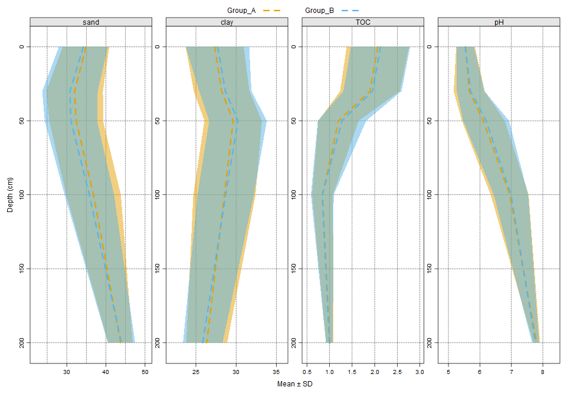
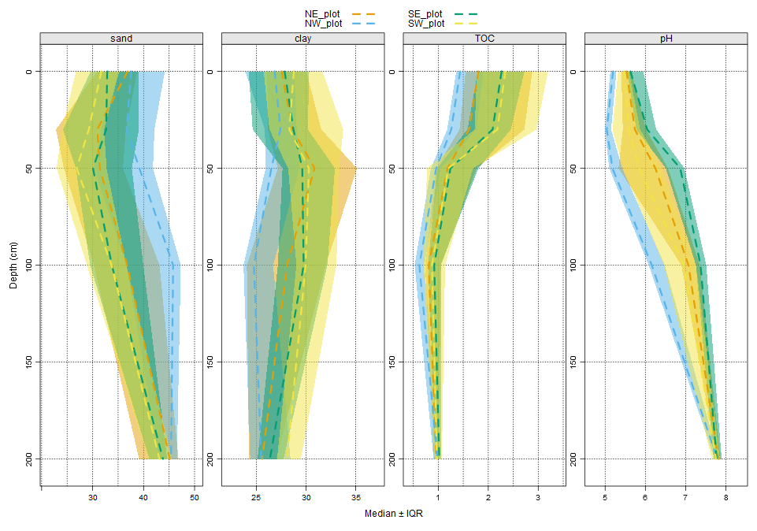
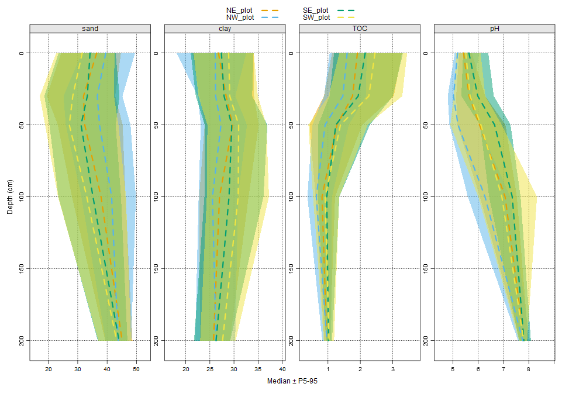

# 🌽🧑‍🌾🥄 sabR: Example Workflow

This example demonstrates how to use the `sabR` package to:

- Load local raster stacks of soil properties  
- Compute **zonal statistics** from **plots/polygons**  
- Convert **plots**, **points**, and **rasters** into `SoilProfileCollection` objects  
- Plot depth functions grouped by ID, polygon, or point clusters  

---

## 📦 Load Required Libraries

```r
library(sabR)
library(sf)
library(ggplot2)
library(lattice)
library(terra)
```

---

## 📁 Define Inputs and Load AOI

```r
raster_dir <- "T:/IA-Kitchen/results/maps/Batch1" ###Check your location on shared BOX drive
shapefile_path <- system.file("extdata", "SABRplots.shp", package = "sabR")
plots <- sf::st_read(shapefile_path)
```

---

## 🧮 Depth-weighted Zonal Statistics from `sabr.zonalstats`

```r
results <- sabr.zonalstats(
  raster_path = raster_dir,
  tdepth = 0,
  bdepth = 20,
  props = c("sand", "clay", "TOC", "pH"),
  shapes = plots,
  plots = c("NW_plot", "SW_plot", "NE_plot", "SE_plot"),
  stats = c("mean", "sd", "min", "max"),
  output_dir = tempdir(),
  PSDnormalize = TRUE,
  MakePlot = FALSE,
  wtd.mean = TRUE
)
```

---

## 📊 Plotting Weighted Mean ± SD

```r
ggplot(results$Weighted, aes(x = plot, y = weighted_mean, color = SoilProperty)) +
  geom_errorbar(
    aes(ymin = weighted_mean - weighted_sd, ymax = weighted_mean + weighted_sd),
    width = 0.2, position = position_dodge(0.6)
  ) +
  geom_point(position = position_dodge(0.6), size = 4) +
  facet_wrap(~SoilProperty, scales = "free_y") +
  theme_minimal(base_size = 13) +
  labs(
    x = "Plot", y = "Weighted Mean ± SD",
    title = "Depth-weighted Zonal Stats by Plot and Soil Property 0–20 cm",
    color = "Soil Property"
  ) +
  theme(axis.text.x = element_text(angle = 45, hjust = 1))
```

## 📊 Plotting Weighted Mean ± SD Output


---

## 🌐 Fetch SABR Raster Stack

```r
sabr <- fetch_sabR(
  raster_path = raster_dir,
  props = c("sand", "clay", "TOC", "pH"),
  depths = c("0-5", "5-15", "15-30", "30-60", "60-100", "100-150", "150-200"),
  PSDnormalize = TRUE,
  aoi = plots,
  resample_method = "cubic",
  resample_res = 12
)
```

---

## 🧱 Raster Stack → SoilProfileCollection

```r
sabr_spc <- sabRas_to_spc(
  stack = sabr$stack,
  props = c("sand", "clay", "TOC", "pH"),
  depths = c("0-5", "5-15", "15-30", "30-60", "60-100", "100-150", "150-200"),
  new_depths = c(0, 20, 40, 60, 100, 200),
  source = sabr$product
)
```

---

## 📐 Plots and Polygons → SoilProfileCollection

```r
zones <- sf::st_read(system.file("extdata", "SABRplots.shp", package = "sabR"))

zones_spc <- sabRzs_to_spc(
  stack = sabr$stack,
  aoi = zones,
  zones = c("NW_plot", "SW_plot", "NE_plot", "SE_plot"),
  id_column = "Name",
  props = c("sand", "clay", "TOC", "pH"),
  depths = c("0-5", "5-15", "15-30", "30-60", "60-100", "100-150", "150-200"),
  new_depths = c(0, 20, 40, 60, 100, 200),
  stats = c("mean", "sd"),
  source = "SABR"
)
```

---

## 📍 Points → SoilProfileCollection (SPC)

```r
set.seed(42)
aoi_sf <- if (!inherits(plots, "sf")) sf::st_as_sf(plots) else plots
rand_pts <- sf::st_sample(aoi_sf, size = 25, type = "random") %>% sf::st_as_sf()
rand_pts$Name <- paste0("pt_", seq_len(nrow(rand_pts)))

pts_spc <- sabRpts_to_spc(
  stack = sabr$stack,
  pts = rand_pts,
  props = c("sand", "clay", "TOC", "pH"),
  depths = c("0-5", "5-15", "15-30", "30-60", "60-100", "100-150", "150-200"),
  new_depths = c(0, 20, 40, 60, 100, 150),
  source = "SABR"
)
```

---

## 🔄 Convert Random Points to SPC Grouped by Column

```r
rand_pts$group <- sample(c("Group_A", "Group_B"), size = nrow(rand_pts), replace = TRUE)

pts_spc_groupcol <- sabRpts_to_spc(
  stack = sabr$stack,
  pts = rand_pts,
  props = c("sand", "clay", "TOC", "pH"),
  depths = c("0-5", "5-15", "15-30", "30-60", "60-100", "100-150", "150-200"),
  new_depths = c(0, 10, 30, 50, 100, 200),
  source = "SABR",
  group_column = "group"
)

sabR_depth(
  spc = pts_spc_groupcol,
  variables = c("sand", "clay", "TOC", "pH"),
  slab_structure = c(0, 10, 30, 50, 100, 200),
  group_id = "group_id",
  stat = "mean_sd"
)
```
## 📍 Points SPC Grouped by Column Output 



---

## 🔄 Convert Points to SPC Grouped by Polygon

```r
subset_plots <- plots[plots$Name %in% c("NW_plot", "SW_plot", "NE_plot", "SE_plot"), ]

pts_spc_polygroup <- sabRpts_to_spc(
  stack = sabr$stack,
  pts = rand_pts,
  props = c("sand", "clay", "TOC", "pH"),
  depths = c("0-5", "5-15", "15-30", "30-60", "60-100", "100-150", "150-200"),
  new_depths = c(0, 10, 30, 50, 100, 200),
  source = "SABR",
  group_poly = subset_plots,
  id_column = "Name"
)

pts_spc_polygroup <- pts_spc_polygroup[!is.na(pts_spc_polygroup$group_id), ]

sabR_depth(
  spc = pts_spc_polygroup,
  variables = c("sand", "clay", "TOC", "pH"),
  slab_structure = c(0, 10, 30, 50, 100, 200),
  group_id = "group_id",
  stat = "med_qr",
  intervals = c(0.25, 0.75)
)
```
## 📍 Points SPC Grouped by Plot Output



---

## 🌍 Convert Raster to SPC Grouped by Polygon

```r
sabr_spc <- sabRas_to_spc(
  stack = sabr$stack,
  props = c("sand", "clay", "TOC", "pH"),
  depths = c("0-5", "5-15", "15-30", "30-60", "60-100", "100-150", "150-200"),
  new_depths = c(0, 10, 30, 50, 100, 200),
  source = "SABR",
  group_poly = subset_plots,
  id_column = "Name"
)

sabr_spc <- sabr_spc[!is.na(sabr_spc$group_id), ]

sabR_depth(
  spc = sabr_spc,
  variables = c("sand", "clay", "TOC", "pH"),
  slab_structure = c(0, 10, 30, 50, 100, 200),
  group_id = "group_id",
  stat = "med_pr",
  intervals = c(5, 95)
)
```
## 🌍 Raster SPC Grouped by Plot Output



---
